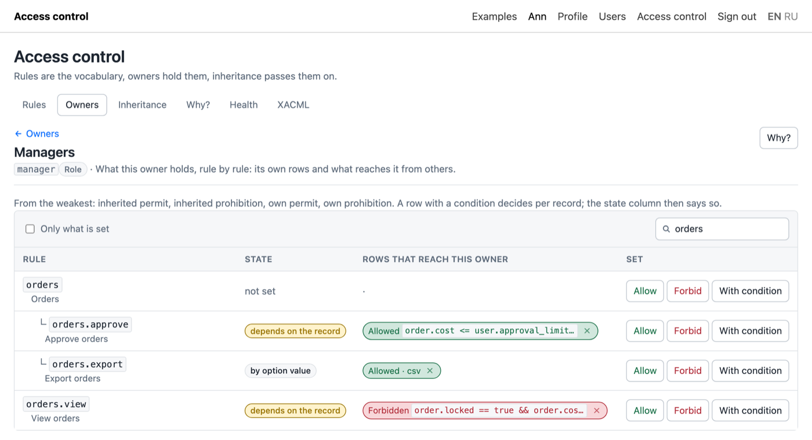
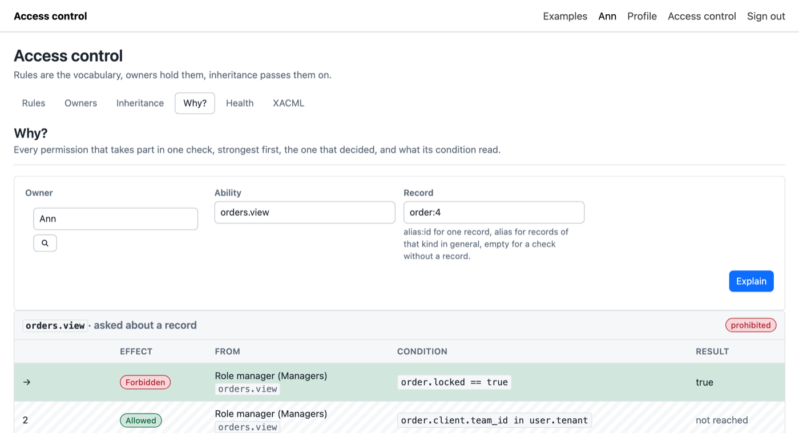
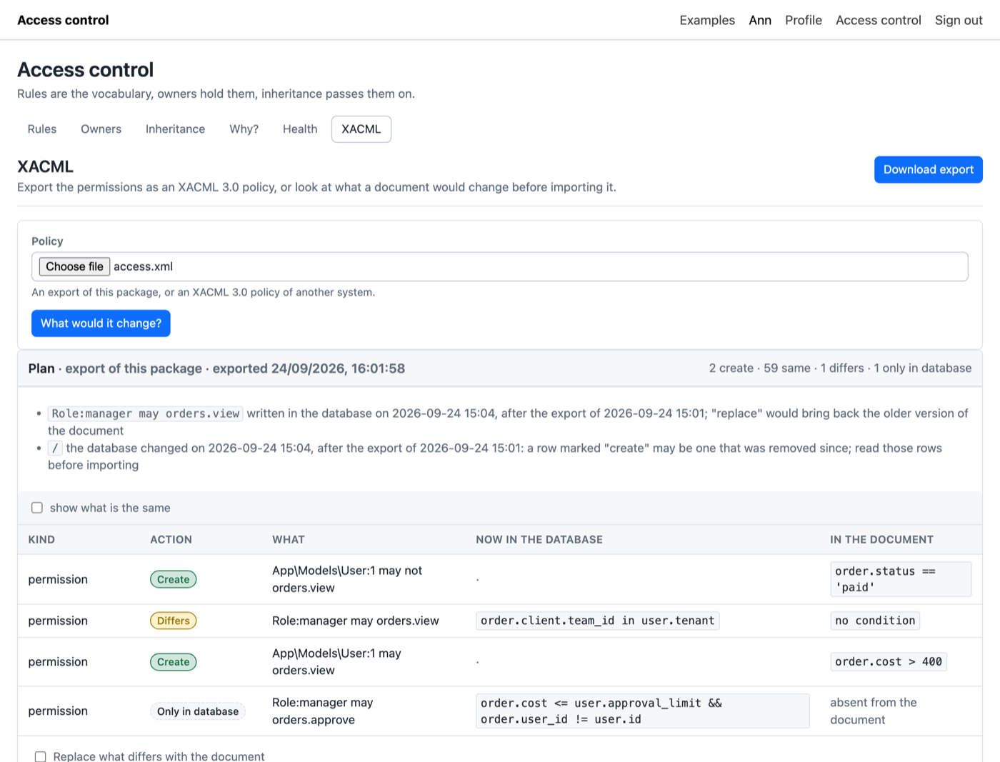
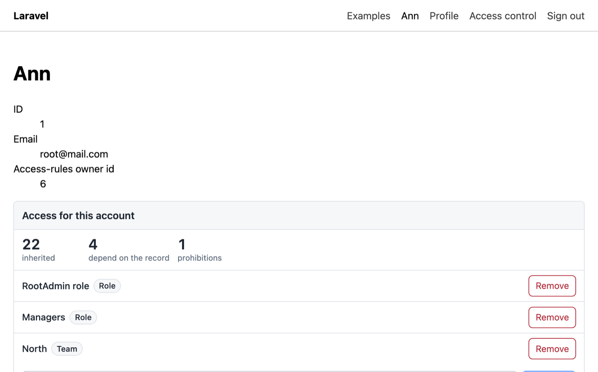

# Laravel Access Control Rules UI

The administration panel of [wnikk/laravel-access-rules](https://github.com/wnikk/laravel-access-rules) 3.x: rules, owners, permissions with conditions, inheritance, the explanation of one check, a health check of stored conditions, XACML export and import, and one card for a page of your application that shows an account.

[](//packagist.org/packages/wnikk/laravel-access-ui)
[](https://packagist.org/packages/wnikk/laravel-access-ui)
[](https://packagist.org/packages/wnikk/laravel-access-ui)
[](//packagist.org/packages/wnikk/laravel-access-ui)

One script and one stylesheet, published into `public/`. No CSS framework, no CDN, no web font, no asset pipeline to agree with.

**And no knowledge of your application.** The panel reads and writes the tables of the core and nothing else. It never loads or names a model of yours to find an owner. Integration is one expression, the owner id, which the core already gives you through the trait it asks you to add to the user model.

**And no logic of access of its own.** Every write goes through the API of the core, every decision comes from its `explain()`. What the panel shows is what the core will do.



## What you get

| Screen | What it does |
|---|---|
| **Rules** | the names your code checks against, with their origin: rules of code keep their name and condition, rules of the panel are created for names code builds at run time |
| **Owners** | the rows that hold permissions, paged and searched, whatever their type |
| **Permissions** | for one owner, rule by rule: every permit and prohibition that reaches it, each with its condition; Allow, Forbid, With condition |
| **Inheritance** | who inherits from whom |
| **Why?** | one check explained: every permission that took part, the one that decided, what its condition read |
| **Health** | what `acr:lint` finds, with "fix" and a cache button |
| **XACML** | download the policy; upload one and see what it would change before importing |
| **The card** | on a user page: what the account inherits from, what may be assigned, four numbers |

## New in 3.0

- **Conditions.** A permit or a prohibition may carry a condition of the core: `order.client.team_id in user.tenant`. The editor completes names from your models and asks the compiler of the core whether the text would save, while you type.

  

- **A permit and a prohibition of one rule live together**, each with its own condition. The state column labels a rule by the five steps of the core: allowed, forbidden, depends on the record, by option value, not set.
- **Why?** answers "why can't Ann see order 4" with the table `acr:explain` prints, an arrow on the row that decided.

  

- **Rules carry their origin.** A rule a migration created is protected: the panel changes its title, place and options, and refuses to rename it, change its condition or delete it. Delete is for good and is refused while somebody holds the rule; the holders are shown.
- **Health** lists stored conditions that stopped matching your models after a migration.
- **XACML** shows the plan of an import, what differs side by side, before anything is written.

  

Kept from 2.0: styles under `wacu-`, light and dark, a layout of yours or a bare page, screens with `enabled`, `write` and `ability`, entities as configuration, the card in one line, one JSON envelope, translations key by key.

## Requirements

- PHP 8.4 or newer
- Laravel 13 or newer
- `wnikk/laravel-access-rules` 3.2.4 or newer, installed and migrated

For an older application: `composer require wnikk/laravel-access-ui:^2.0`.

## Install

```bash
composer require wnikk/laravel-access-ui

php artisan vendor:publish --tag=accessUi-config
php artisan vendor:publish --tag=accessUi-assets
```

The second command is required: it copies the bundle to `public/vendor/accessui`. Repeat it with `--force` after every upgrade.

Then turn the routes on. **Nothing is registered until both keys are set**, because these routes hand out permissions and an install nobody configured must expose nothing:

```php
// config/accessUi.php
'routes' => [
    'prefix'     => 'access-control',
    'middleware' => ['web', 'auth', 'can:manage-access'],
],
```

`['web', 'auth']` alone lets every signed-in account grant itself everything. Name what marks an administrator in your application: a Gate (`can:manage-access`), a rule of the core (`can:system.access.manage`), or a middleware of yours (`admin`).

Open `/access-control`. To render the panel inside your admin area, name your layout:

```php
'layout' => ['view' => 'layouts.admin', 'section' => 'content', 'title' => 'Access control'],
```

## The card on a user page

```blade
@accessUiWidget(['owner' => $user])
```



What this account inherits from, a dropdown of what may still be assigned, a remove button per row, and four numbers: inherited rows, own rows, rows that depend on the record, prohibitions. Own rows on an account with nothing assigned mean somebody hand-tuned it. The line renders nothing while the routes are off, so it is safe in every environment.

Whether the card may change anything is decided on the server, per request and per owner: config `widget.write` and a Gate ability that receives the owner of the card. The page gets what the card uses and nothing else.

## Documentation

- [Installation](docs/installation.md): requirements, publishing, the routes and the gate, a first check
- [Configuration](docs/configuration.md): routes, layout and theme, assets, entities, screens, pickers
- [Screens](docs/screens.md): every screen and what it shows
- [The assignment card](docs/widget.md): the directive, the numbers, use outside Blade
- [The editor of conditions](docs/conditions-editor.md): autocompletion and the check by the core
- [XACML](docs/xacml.md): download, the plan, replace and partial
- [Routes and the envelope](docs/routes.md): for a page of your own
- [Upgrade from 2.0 to 3.0](docs/upgrade-2-to-3.md)

The language of conditions, the priority of permissions and the API of the core are documented by the core: [conditions](https://github.com/wnikk/laravel-access-rules/blob/main/docs/conditions.md), [basic usage](https://github.com/wnikk/laravel-access-rules/blob/main/docs/basic-usage.md).

## Seeding rules

The panel manages rules and does not invent the ones your code checks. Create those in a migration or a seeder of the core:

```php
use Wnikk\LaravelAccessRules\Facades\Access;

Access::newRule('orders', 'Orders');
Access::newRule('orders.view', 'View orders', resource: 'order');
Access::newRule('orders.export', 'Export orders', options: 'required|in:csv,pdf', resource: 'order');

Access::for('Role', 'manager')->create('Managers');
Access::for('Role', 'manager')->allow('orders.view');
```

## Restyling and translations

```css
.wacu-root { --wacu-accent: #6d28d9; --wacu-radius: 2px; --wacu-font: "Inter", sans-serif; }
```

```html
<script>window.accessUiMessages = { de: { 'rules.title': 'Regeln', 'permissions.allow': 'Erlauben' } };</script>
```

Put that before the bundle and the first render is translated; `accessUi.addMessages('de', {...})` after it adds or corrects strings. Keys are in `resources/js/lang/en.json`; English is the fallback key by key. Refusals of the core are translated on the server: `vendor:publish --tag=accessUi-lang`.

## Building from source

```bash
npm ci
npm run build
```

Output is `dist/accessUi.js` and `dist/accessUi.css`, an IIFE a page loads with a plain `<script src>`. Vue is bundled in: the panel works on a machine with no route to the internet. `dist/` is committed, so installing needs no Node.

## For AI coding agents

The package ships a Laravel Boost guideline and a skill (`resources/boost/`), installed into an application by `php artisan boost:install`, and `docs/llms.txt` as a map of the documentation. Agents working on this repository read `AGENTS.md`.

## Caveats

**No audit trail.** The core fires `AccessChanged` on every change; listen to it for a log of who changed what.

**No rate limiting.** Add `throttle:` to the middleware of the group when more than a few administrators reach it.

**Deleting an owner row is for good.** Its permissions and links go with it, and everyone who inherited from it loses what it held.

## Contributing

Please report any issue you find in the issues page. Pull requests are more than welcome.

## License

The MIT License (MIT). Please see [License File](LICENSE.md) for more information.
