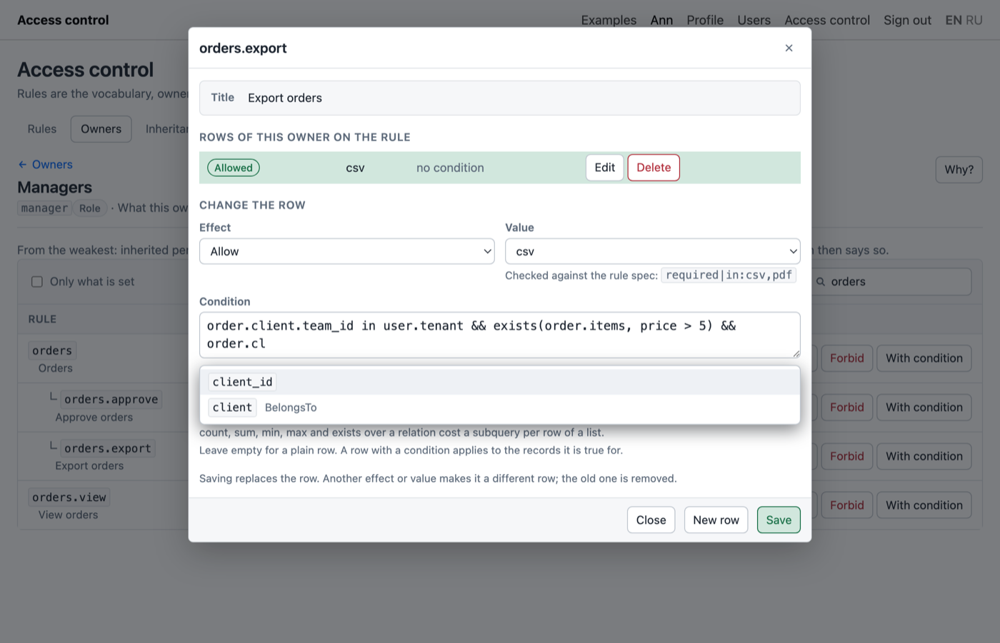

# The editor of conditions

A permit, a prohibition or a rule may carry a condition: one line of text the core evaluates for a record and compiles into the WHERE of a list. The panel edits that text in one field, on the permissions screen and on the form of a rule.

## Autocompletion

The suggestions come from the models of `config/access.php`:

| Typed | Suggested |
|---|---|
| `or` | the aliases of `access.resources`, `user`, `env`, `resource` (the record the rule is about), the functions of the core, the keywords |
| `order.` | the columns of that model from the schema, its relations from the return types of its methods, `count` |
| `order.client.` | the same for the related model, as deep as the chain of relations goes |
| `user.` | `id`, `tenant`, `roles`, `guest`; any attribute of the user works, these are the ones the core defines |
| `env.` | `now`, `today`, `time`, `hour`, `weekday`, `ip`, `app` |

Tab or Enter accepts, the arrows move, Escape closes. The vocabulary is approximate on purpose: a name that is missing costs a suggestion, never a wrong write, because the core compiles the text before it is saved.

A relation is suggested when the method declares its return type: `public function client(): BelongsTo`. The core reads conditions by the same rule and never calls a method to find out what it returns.

## The check

While you type, the panel sends the text to `POST {prefix}/conditions/check`, which runs `Cond::compile()` of the core, the same compiler that saving uses. After a pause of a third of a second the line under the field shows one of three things:

- the condition as the core will store it, printed back from the tree;
- the refusal of the core, word for word, in red. The Save button stays disabled;
- a note that the condition uses `count`, `sum`, `min`, `max` or `exists` over a relation. Those cost a correlated subquery per row when a list is filtered; on a big table a counter column is cheaper.

An empty field is valid and means no condition.

The check writes nothing and reveals nothing of the data. It is reachable whenever the panel is, because the editor sits inside two screens that are guarded on their own routes.

## The language

The language belongs to the core and is described there: [Conditions](https://github.com/wnikk/laravel-access-rules/blob/main/docs/conditions.md). What the panel adds is the check before saving and the names to pick from.
