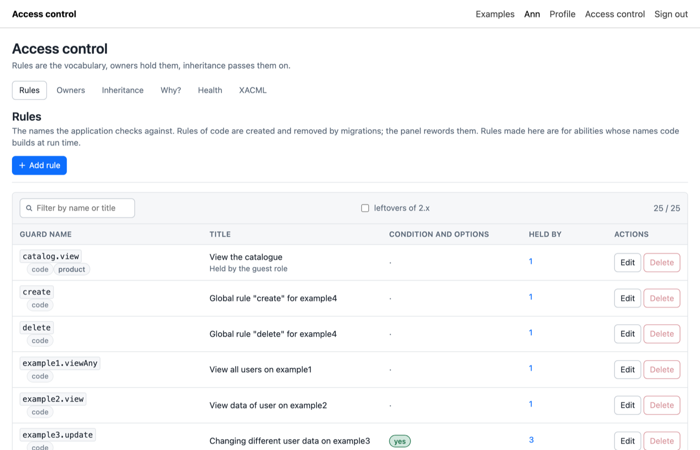

# Screens

Rules are the vocabulary, owners hold them, inheritance passes them on. The tabs of the panel follow that order; the permissions of one owner open from the owners screen.

## Rules

Every rule the application checks against, as a tree under `parent_id`. The tree is presentation: the core grants a parent to nobody because a child was granted.

Each row shows the origin of the rule. A rule of **code** was created by a migration or a seeder: the panel may change its title, description, place in the tree and option spec, and refuses to rename it, change its model or condition, or delete it, because code was written against those. The form shows what the code was written against as facts and what may change as fields. With `rule_tree_inheritance` on, the place decides what a permission covers and stays with the code too. A **custom** rule was created in the panel, for abilities whose names code builds at run time, such as `news.edit.sport`. An **import** rule arrived through XACML. Both of the latter are fully editable.

A rule may name a **resource**, the alias of a model from `config/access.php`, and a **condition** of its own, which every permit of the rule has to satisfy on top of its own. The condition column shows a mark for a condition and the option spec of a rule that takes one. "Held by" counts the owners with a row on the rule and opens the list.

Delete is for good. The panel refuses it while somebody holds the rule and shows the holders, because the prohibitions on the rule would vanish with it. Rules that 2.x had soft deleted are listed as `deprecated__<name>` behind the filter "leftovers of 2.x".

## Owners

Paged and searched rows of the owner table: the configured entities, plus any owner of another type that holds a permission, marked as unlisted. Tenants and the guest owner of the core carry a mark. Each row counts its permissions, what it inherits from and who inherits from it; "who inherits from this" lists everyone a change would reach.

The identifier and the name are asked for apart when a row is created: the identifier is the machine name migrations and seeders refer to, the name is what administrators read.

## Permissions of one owner

Rule by rule, what reaches this owner: its own rows and the rows of everything it inherits from, strongest first. A permit and a prohibition of one rule are two rows and may exist together, each with a condition: "may see orders of its team, may not see locked ones". So every row is written and removed on its own, and pressing Allow never removes a prohibition.

The state column labels the rule by the five steps of the core:

| Label | Meaning |
|---|---|
| Allowed, Forbidden | a row without a condition decides; a tree mark says the row is inherited |
| depends on the record | the deciding row carries a condition; the answer differs per record |
| by option value | the rule takes an option and rows exist for some values |
| not set | nothing reaches the owner |

The label comes from the rows, not from a check. Whether a condition holds for one record is what the "Why?" button answers. A rule with the suffix `.self` carries the mark "author only". With `rule_tree_inheritance` on in the config of the core, a row on a rule also reaches the rules below it: the matrix shows such a row under the rule it reaches, marked "through" the rule it sits on, and it is changed there.

A long condition on a chip is cut; the whole text is in the tooltip.

**Allow** and **Forbid** write a plain row. **With condition** opens the window of the rule: every row the owner holds on it, each to change or to delete, and the fields for a new row or the changed one, the effect, the option value checked against the spec of the rule, and the [editor of conditions](conditions-editor.md). The window stays open across writes. An own row is also removed with the cross on its chip in the matrix.

## Inheritance

Who inherits from whom. The left side lists the sources of rights: the configured entities and any owner that holds something. Pick one, and the right side lists who inherits from it, with what those links drag in behind them: an account that inherits from a role which inherits from another is reached through the first link. Indirect rows are marked with the direct link they came through; that link is the one to remove. Any owner of the table may be added as an inheritor.

The other direction, what one account inherits from, is the [assignment card](widget.md), which sits on a page of the application.

The core refuses a link that would close a loop.

## Why?

One check, explained the way `acr:explain` prints it. Pick an owner, type an ability and name a record as `alias:id`, the alias alone for records of that kind in general, or nothing for a check without a record. The table lists every permission that took part, strongest first, an arrow on the one that decided, the condition of each row and what it read: true, false, not reached. Below, the values the conditions read from the record, the user and the environment. A warning appears when the cached permissions disagree with the database.

When the owner is a user, the panel loads that user for the check, because conditions read `user.` attributes from it. That is the one place where the panel touches a model of the application.

## Health

What `acr:lint` finds, as a table: a stored condition that names a column a migration renamed, a model that left `config/access.php`, a rule whose resource is unknown. Each finding names where it is and opens the permissions of that owner. "Fix" saves again the conditions whose column types changed. The cache button drops cached permissions; every change through the panel turns the cache over by itself, the button is for rows changed with plain SQL.

## XACML

Download the whole set as an XACML 3.0 policy, or upload one and see what it would change before it is written. Described on its own page: [XACML](xacml.md).

## Navigation

The place in the panel lives in the URL hash, and every screen and every window is an entry of the browser history: the back button closes a window, then leaves a screen the way it was entered. A hash can be sent to somebody or bookmarked and opens the place straight away, an editor included:

| Hash | Opens |
|---|---|
| `#!/rules`, `#!/owners`, `#!/inherit`, `#!/explain`, `#!/health`, `#!/xacml` | a screen |
| `#!/rules/new`, `#!/rules/edit/12`, `#!/rules/holders/12` | the rules screen with a window: a new rule, the editor of rule 12, who holds it |
| `#!/owners/new`, `#!/owners/rename/7`, `#!/owners/heirs/7` | the owners screen with a window: a new owner, renaming owner 7, its heirs |
| `#!/permissions/7`, `#!/permissions/7/rule/12` | the matrix of owner 7; with the window of rule 12 open |
| `#!/inherit/7`, `#!/explain/7` | inheritance with owner 7 picked; "Why?" with owner 7 chosen |

Ids are those of the rows of the core. A hash naming a screen that is off, or a rule or owner that does not exist, falls back to the first screen.
